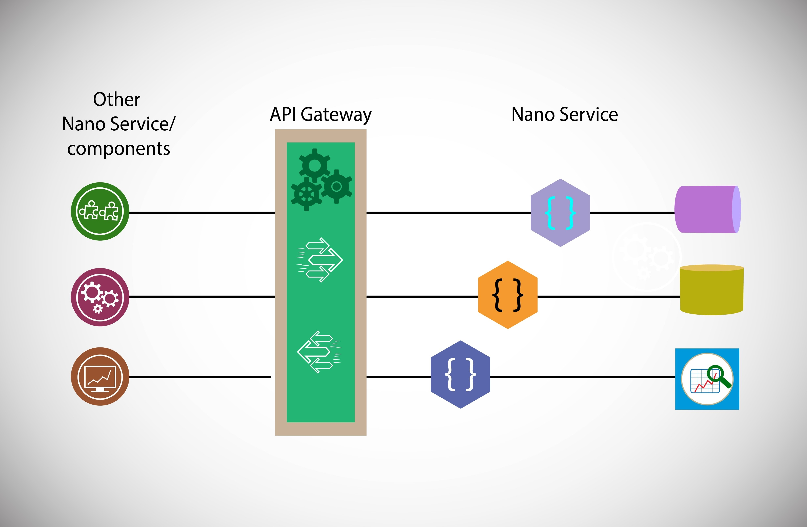

একটি API-কে তখনই **RESTful** বলা হয় যখন সেটি **REST (Representational State Transfer)** আর্কিটেকচারাল স্টাইলের নির্দিষ্ট কিছু নিয়ম বা সীমাবদ্ধতা (Constraints) মেনে চলে। ২০০০ সালে রয় ফিল্ডিং তার পিএইচডি থিসিসে এই ধারণাটি প্রবর্তন করেন।

নিচে RESTful API-এর প্রধান ৬টি কনস্ট্রেইন্ট বা শর্ত বিস্তারিত আলোচনা করা হলো:

### ১. Client-Server Architecture (ক্লায়েন্ট-সার্ভার আর্কিটেকচার)
এটি ক্লায়েন্ট (ইউজার ইন্টারফেস) এবং সার্ভারকে (ডাটা এবং ব্যাকএন্ড লজিক) আলাদা রাখে।
* **সুবিধা:** ক্লায়েন্ট এবং সার্ভার একে অপরের থেকে স্বাধীনভাবে উন্নত হতে পারে। যেমন, আপনি আপনার **MyAliv** প্রজেক্টে ফ্রন্টএন্ডে Next.js ব্যবহার করেছেন এবং ব্যাকএন্ডে Django; তারা শুধু এপিআই-এর মাধ্যমে কথা বলে।


### ২. Statelessness (স্টেটলেসনেস)
সার্ভার ক্লায়েন্টের কোনো আগের রিকোয়েস্টের তথ্য (Session) জমা রাখে না। প্রতিটি রিকোয়েস্টের মধ্যেই প্রয়োজনীয় সব তথ্য (যেমন: Authentication Token) থাকতে হবে যাতে সার্ভার রিকোয়েস্টটি বুঝতে পারে।
* **সুবিধা:** এটি স্কেলেবিলিটি বাড়ায়, কারণ সার্ভারকে ইউজারের স্টেট মনে রাখতে হয় না।

### ৩. Cacheability (ক্যাশেবিলিটি)
সার্ভারের রেসপন্সে উল্লেখ থাকতে হবে যে ডাটাটি ক্যাশ (Cache) করে রাখা যাবে কি না।
* **সুবিধা:** এটি নেটওয়ার্ক ট্রাফিক কমায় এবং অ্যাপ্লিকেশনকে আরও দ্রুত করে।

### ৪. Layered System (লেয়ারড সিস্টেম)
ক্লায়েন্ট সরাসরি সার্ভারের সাথে কথা বলছে নাকি মাঝখানে কোনো লোড ব্যালেন্সার বা প্রক্সি আছে, তা ক্লায়েন্ট জানার প্রয়োজন নেই।
* **উদাহরণ:** আপনার **Crossworks** প্রজেক্টে যখন রিকোয়েস্ট আসে, তখন ক্লায়েন্ট জানে না পেছনে কয়টি মাইক্রোসার্ভিস বা ডাটাবেস লেয়ার কাজ করছে।


### ৫. Uniform Interface (ইউনিফর্ম ইন্টারফেস)
এটি REST-এর সবচেয়ে গুরুত্বপূর্ণ অংশ। এটি নিশ্চিত করে যে সিস্টেমের সব রিসোর্স একইভাবে অ্যাক্সেস করা যাবে। এর চারটি সাব-পার্ট আছে:
* **Resource Identification:** ইউআরএল (URL)-এর মাধ্যমে রিসোর্স চিনতে পারা (যেমন: `/api/v1/orders/1`).
* **Manipulation through Representations:** ক্লায়েন্টের কাছে রিসোর্সের পর্যাপ্ত তথ্য থাকলে সে তা আপডেট বা ডিলিট করতে পারে।
* **Self-descriptive Messages:** প্রতিটি মেসেজে কীভাবে সেটি প্রসেস করতে হবে তা বলা থাকে (যেমন: `Content-Type: application/json`).
* **HATEOAS:** রেসপন্সের মধ্যেই পরবর্তী সম্ভাব্য অ্যাকশনগুলোর লিঙ্ক দেওয়া থাকা।

### ৬. Code on Demand (অপশনাল)
সার্ভার চাইলে ক্লায়েন্টের কাছে এক্সিকিউটেবল কোড (যেমন: JavaScript applet) পাঠাতে পারে। এটি একমাত্র ঐচ্ছিক বা অপশনাল শর্ত।

---

### কেন এটি আপনার জন্য গুরুত্বপূর্ণ?

আপনার **SaaS Based Invoice App** বা **Restaurant App**-এ আপনি **Django Rest Framework (DRF)** ব্যবহার করেছেন। DRF ডিফল্টভাবে এই কনস্ট্রেইন্টগুলো মেনে চলতে সাহায্য করে।

**ইন্টারভিউ টিপ (UCB-র জন্য):**
ব্যাংকিং এপিআই ডিজাইনের ক্ষেত্রে **Statelessness** এবং **Uniform Interface** অত্যন্ত জরুরি। আপনি বলতে পারেন:
> *"আমি যখন এপিআই ডিজাইন করি, তখন আমি **Uniform Interface** নিশ্চিত করি যাতে ডিফারেন্ট ক্লায়েন্ট (Mobile, Web, ATM) একই স্ট্যান্ডার্ডে কথা বলতে পারে। এছাড়া **Statelessness** নিশ্চিত করার জন্য আমি **JWT (JSON Web Token)** ব্যবহার করি, যা সার্ভারের ওপর চাপ কমায় এবং সিকিউরিটি বাড়ায়।"*

আপনি কি আপনার প্রজেক্টের কোনো এপিআই-তে **HATEOAS** বা **Caching** ইমপ্লিমেন্ট করেছিলেন? প্রয়োজনে আমি উদাহরণ দিতে পারি।


**HATEOAS**-এর পূর্ণরূপ হলো **Hypermedia As The Engine Of Application State**। এটি RESTful এপিআই আর্কিটেকচারের একটি অন্যতম প্রধান এবং আধুনিক কনস্ট্রেইন্ট (শর্ত)।

সহজ কথায়, একটি এপিআই রেসপন্সে যখন শুধু ডেটাই থাকে না, বরং সেই ডেটার সাথে পরবর্তী কী কী অ্যাকশন নেওয়া সম্ভব তার লিঙ্কগুলোও (Hyperlinks) দেওয়া থাকে, তাকেই HATEOAS বলা হয়।

### কেন এটি গুরুত্বপূর্ণ?
সাধারণ এপিআই-তে ক্লায়েন্টকে আগে থেকেই জানতে হয় কোন এন্ডপয়েন্টে রিকোয়েস্ট পাঠাতে হবে। কিন্তু HATEOAS থাকলে ক্লায়েন্ট অনেকটা ব্রাউজারের মতো কাজ করে—একটি পেজে গিয়ে যেমন অন্য পেজের লিঙ্ক পাওয়া যায়, তেমনি এপিআই রেসপন্স থেকেই পরবর্তী গন্তব্য জানা যায়।


---

### একটি বাস্তব উদাহরণ (আপনার ইনভয়েস অ্যাপের প্রেক্ষিতে)

ধরা যাক, আপনার **SaaS Based Invoice App**-এ একজন ইউজার একটি ইনভয়েসের ডিটেইলস দেখতে চাচ্ছেন। 

**HATEOAS ছাড়া রেসপন্স:**
```json
{
    "invoice_id": 101,
    "status": "unpaid",
    "amount": 500.00
}
```
এখানে ক্লায়েন্ট জানে না কীভাবে পেমেন্ট করতে হবে বা কীভাবে এটি ডিলিট করতে হবে। তাকে কোডবুকে এন্ডপয়েন্ট হার্ডকোড করে রাখতে হবে।

**HATEOAS সহ রেসপন্স:**
```json
{
    "invoice_id": 101,
    "status": "unpaid",
    "amount": 500.00,
    "links": [
        {"rel": "self", "href": "/api/v1/invoices/101", "method": "GET"},
        {"rel": "pay", "href": "/api/v1/invoices/101/pay", "method": "POST"},
        {"rel": "cancel", "href": "/api/v1/invoices/101/cancel", "method": "DELETE"}
    ]
}
```
এখানে `links` সেকশনটি ক্লায়েন্টকে বলে দিচ্ছে যে সে এখন চাইলে পেমেন্ট করতে পারবে বা ইনভয়েসটি ক্যান্সেল করতে পারবে।

---

### HATEOAS-এর প্রধান সুবিধাসমূহ:

১. **ডাইনামিক ন্যাভিগেশন:** সার্ভার যদি কোনো এন্ডপয়েন্ট পরিবর্তন করে (যেমন: `/pay` থেকে `/make-payment`), তবে ক্লায়েন্ট সাইডে কোনো কোড চেঞ্জ করতে হয় না, কারণ লিঙ্কটি সার্ভার থেকে ডাইনামিকালি আসছে।
২. **সেলফ-ডেসক্রিপটিভ:** এপিআই ডকুমেন্টেশন বারবার দেখার প্রয়োজন কমে যায়। রেসপন্স দেখেই বোঝা যায় পরবর্তীতে কী করা সম্ভব।
৩. **বিজনেজ লজিক কন্ট্রোল:** যদি কোনো ইনভয়েস অলরেডি 'Paid' হয়ে যায়, তবে সার্ভার রেসপন্স থেকে 'pay' লিঙ্কটি সরিয়ে দিতে পারে। ক্লায়েন্ট অটোমেটিক্যালি বুঝবে যে এখন আর পেমেন্ট বাটন দেখানোর প্রয়োজন নেই।


---

### জ্যাঙ্গো রেস্ট ফ্রেমওয়ার্ক (DRF)-এ ব্যবহার
আপনি আপনার প্রজেক্টে `HyperlinkedModelSerializer` ব্যবহার করে সহজেই HATEOAS-এর প্রাথমিক লেভেল ইমপ্লিমেন্ট করতে পারেন। এটি প্রাইমারি কি-এর বদলে রিসোর্সের জন্য সরাসরি ইউআরএল (URL) রিটার্ন করে।

### ইন্টারভিউ টিপ (UCB-র জন্য):
ব্যাংকিং এপিআই-তে সিকিউরিটি এবং প্রসেস ফ্লো খুব গুরুত্বপূর্ণ। আপনি বলতে পারেন:
> *"আমি এপিআই-তে **HATEOAS** পছন্দ করি কারণ এটি সিস্টেমকে লুজলি কাপলড (Loosely Coupled) রাখে। বিশেষ করে ট্রানজেকশন প্রসেসিংয়ে পেমেন্ট সাকসেস বা ফেইল হওয়ার ওপর ভিত্তি করে পরবর্তী বৈধ ধাপগুলো রেসপন্স লিঙ্ক হিসেবে পাঠিয়ে দিলে ক্লায়েন্ট সাইডে লজিক্যাল এরর হওয়ার সম্ভাবনা অনেক কমে যায়।"*

এটি কি আপনার **Crossworks** বা **MyAliv** প্রজেক্টের এপিআই ডিজাইন ফিলোসফির সাথে মেলে? নাকি আপনি মূলত সাধারণ JSON রেসপন্স ব্যবহার করেছেন?

এপিআই-এর পরিবর্তন করার সময় **Backward Compatibility** বজায় রাখা অত্যন্ত গুরুত্বপূর্ণ, বিশেষ করে যখন আপনার সিস্টেমটি অনেক ইউজার বা থার্ড-পার্টি সার্ভিস ব্যবহার করে। এটি নিশ্চিত করে যে আপনার নতুন পরিবর্তনের ফলে পুরোনো ক্লায়েন্টদের (যেমন মোবাইল অ্যাপ বা পুরোনো ইন্টিগ্রেশন) কাজ বন্ধ হয়ে যাবে না।

নিচে এপিআই-তে ব্যাকওয়ার্ড কম্প্যাটিবিলিটি বজায় রাখার প্রধান কৌশলগুলো আলোচনা করা হলো:

### ১. এপিআই ভার্সনিং (API Versioning)
এটি সবচেয়ে প্রচলিত এবং কার্যকর উপায়। যখনই কোনো ব্রেকিং চেঞ্জ (Breaking Change) আসে, তখন নতুন একটি ভার্সন লঞ্চ করা হয়।

* **URL Versioning:** ইউআরএল-এ ভার্সন উল্লেখ করা (যেমন: `/api/v1/` থেকে `/api/v2/`)। আপনার **Crossworks** বা **MyAliv** প্রজেক্টে সম্ভবত এটিই ব্যবহার করেছেন।
* **Header Versioning:** কাস্টম হেডার ব্যবহার করা (যেমন: `Accept: application/vnd.myapi.v2+json`)।
* **Query Parameter Versioning:** যেমন: `/api/products?version=2`।


### ২. অ্যাডিশনাল ফিল্ড যোগ করা (Additive Changes)
এপিআই রেসপন্সে নতুন কোনো ফিল্ড যোগ করলে সাধারণত পুরোনো ক্লায়েন্টদের সমস্যা হয় না, কারণ তারা তাদের প্রয়োজনীয় ফিল্ডগুলো ঠিকই পাচ্ছে এবং অতিরিক্ত ফিল্ডগুলো ইগনোর করছে। কিন্তু কোনো ফিল্ড রিনেম (Rename) করা বা রিমুভ (Remove) করা উচিত নয়।

### ৩. ডিপ্রিকেশন পলিসি (Deprecation Policy)
কোনো এন্ডপয়েন্ট সরাসরি বন্ধ না করে একটি নির্দিষ্ট সময় পর্যন্ত সেটিকে সচল রাখা এবং ডেভেলপারদের সতর্ক করা।
* রেসপন্স হেডারে `Warning` বা `Deprecation` মেসেজ পাঠানো।
* ডকুমেন্টেশনে ক্লিয়ার ডেডলাইন দেওয়া যে কবে নাগাদ পুরোনো ভার্সনটি বন্ধ হয়ে যাবে।

### ৪. ডিফল্ট ভ্যালু ব্যবহার (Default Values)
যদি নতুন কোনো প্যারামিটার বা ফিল্ড রিকোয়েস্টে যোগ করা হয়, তবে সেটির একটি ডিফল্ট ভ্যালু সেট করে রাখা উচিত। যাতে পুরোনো ক্লায়েন্টরা যদি ওই নতুন ফিল্ডটি না পাঠায়, তাহলেও সিস্টেমটি ক্রাশ না করে।

### ৫. ডাটা ট্রান্সফরমেশন লেয়ার (Data Transformation Layer)
আপনার ডাটাবেস স্কিমা পরিবর্তন হলেও এপিআই-এর আউটপুট যেন অপরিবর্তিত থাকে, সেজন্য একটি মাঝখানের লেয়ার (যেমন: Serializer বা Mapper) ব্যবহার করা।
* **উদাহরণ:** ডাটাবেসে `first_name` এবং `last_name` আলাদা করলেও এপিআই রেসপন্সে পুরোনো ক্লায়েন্টের জন্য `full_name` ফিল্ডটি ক্যালকুলেট করে পাঠানো।

---

### ৬. গ্রেসফুল হ্যান্ডলিং-এর কিছু গোল্ডেন রুলস:

* **Don't Rename:** ফিল্ডের নাম পরিবর্তন করবেন না। প্রয়োজনে নতুন ফিল্ড যোগ করুন এবং পুরোনোটি 'Deprecated' হিসেবে মার্ক করুন।
* **Don't Change Data Types:** আগে যদি কোনো ফিল্ডে `Integer` যেত, সেখানে হঠাৎ করে `String` পাঠানো শুরু করবেন না।
* **Keep Constraints Relaxed:** রিকোয়েস্ট বডিতে নতুন কোনো ফিল্ডকে হঠাৎ করেই `Required` করে দেবেন না।

### ৭. বাস্তব উদাহরণ (আপনার অভিজ্ঞতার আলোকে)
আপনার **Restaurant App**-এর কথা চিন্তা করুন। ধরুন, আপনি আগে অর্ডারের সময় শুধু `address` নিতেন। এখন আপনি `latitude` এবং `longitude` নিতে চান। 
* **সঠিক পদ্ধতি:** `address` ফিল্ডটি আগের মতোই রাখুন এবং নতুন দুটি অপশনাল ফিল্ড যোগ করুন। এতে পুরোনো অ্যাপগুলো এখনো শুধু অ্যাড্রেস দিয়ে অর্ডার করতে পারবে, আর নতুন অ্যাপগুলো লোকেশন সুবিধা পাবে।


### ইন্টারভিউ টিপ (UCB-র জন্য):
ব্যাংকিং বা ফিনটেক এপিআই-তে ব্যাকওয়ার্ড কম্প্যাটিবিলিটি খুবই সেনসিটিভ। আপনি বলতে পারেন:
> *"আমি এপিআই পরিবর্তনের সময় **Versioning** এবং **Additive Changes** নীতি অনুসরণ করি। বিশেষ করে যখন কোনো বড় পরিবর্তন আসে, আমি পুরোনো ভার্সনটি অন্তত ৬ মাস থেকে ১ বছর পর্যন্ত সচল রাখি এবং হেডার বা লগের মাধ্যমে ক্লায়েন্টদের মাইগ্রেট করার জন্য নোটিফাই করি।"*

আপনি কি আপনার আগের প্রজেক্টগুলোতে কখনো কোনো 'Breaking Change' হ্যান্ডেল করেছিলেন? সেটি কি ভার্সনিংয়ের মাধ্যমে করা হয়েছিল নাকি অন্য কোনোভাবে?


REST এবং GraphQL উভয়ই এপিআই তৈরির জনপ্রিয় পদ্ধতি, কিন্তু তাদের কাজের ধরন এবং ডাটা আদান-প্রদানের স্টাইল সম্পূর্ণ আলাদা। আপনি আপনার প্রজেক্টগুলোতে (যেমন **MyAliv** বা **Crossworks**) মূলত REST ব্যবহার করেছেন, তবে GraphQL-এর সুবিধাগুলো জানা থাকলে আপনি বুঝতে পারবেন কখন কোনটি বেছে নেওয়া উচিত।

নিছে এদের প্রধান পার্থক্যগুলো ব্যাখ্যা করা হলো:

### ১. ডাটা ফেচিং (Data Fetching)
* **REST:** এখানে প্রতিটি রিসোর্সের জন্য আলাদা আলাদা এন্ডপয়েন্ট থাকে (যেমন: `/users/`, `/posts/`)। যদি আপনার একজন ইউজারের নাম এবং তার সব পোস্টের টাইটেল লাগে, তবে আপনাকে দুটি আলাদা রিকোয়েস্ট পাঠাতে হতে পারে।
* **GraphQL:** এখানে মাত্র একটি এন্ডপয়েন্ট থাকে (সাধারণত `/graphql`)। আপনি একটি মাত্র রিকোয়েস্টেই আপনার প্রয়োজনীয় সব ডাটা নির্দিষ্ট করে বলে দিতে পারেন।


### ২. ওভার-ফেচিং এবং আন্ডার-ফেচিং (Over-fetching & Under-fetching)
* **REST:** অনেক সময় এন্ডপয়েন্ট থেকে এমন অনেক ডাটা আসে যা আপনার প্রয়োজন নেই (Over-fetching)। আবার কখনো একটি এন্ডপয়েন্টের ডাটা যথেষ্ট হয় না, ফলে আরও রিকোয়েস্ট পাঠাতে হয় (Under-fetching)।
* **GraphQL:** আপনি ঠিক যতটুকু ডাটা চাইবেন, সার্ভার ঠিক ততটুকুই পাঠাবে। এটি ব্যান্ডউইথ সাশ্রয় করে এবং পারফরম্যান্স বাড়ায়।

### ৩. টাইপিং এবং স্কিমা (Typing & Schema)
* **REST:** এটি সাধারণত লুজলি টাইপড। এপিআই কী রিটার্ন করবে তা জানার জন্য আপনাকে আলাদাভাবে ডকস (যেমন Swagger) দেখতে হয়।
* **GraphQL:** এটি স্ট্রংলি টাইপড এবং এর একটি সুনির্দিষ্ট **Schema** থাকে। ক্লায়েন্ট আগে থেকেই জানে কোন ফিল্ডের ডাটা টাইপ কী হবে।

---

### ৪. মূল পার্থক্যের টেবিল

| বৈশিষ্ট্য | REST | GraphQL |
| :--- | :--- | :--- |
| **এন্ডপয়েন্ট** | অনেকগুলো (Multiple endpoints)। | মাত্র একটি (Single endpoint)। |
| **ডাটা রিকোয়েস্ট** | সার্ভার নির্ধারণ করে কী পাঠাবে। | ক্লায়েন্ট নির্ধারণ করে কী কী লাগবে। |
| **ভার্সনিং** | সাধারণত ইউআরএল-এ ভার্সন থাকে (v1, v2)। | ভার্সনিংয়ের প্রয়োজন হয় না, শুধু নতুন ফিল্ড যোগ করা হয়। |
| **ক্যাশিং (Caching)** | ব্রাউজার এবং এইচটিটিপি লেভেলে ক্যাশিং সহজ। | ক্যাশিং কিছুটা জটিল কারণ রিকোয়েস্ট সবসময় POST হয়। |
| **পারফরম্যান্স** | ছোট রিকোয়েস্টের জন্য দ্রুত। | মোবাইল অ্যাপ বা জটিল ডাটা রিলেশনের জন্য সেরা। |

---

### ৫. বাস্তব উদাহরণ (আপনার ইনভয়েস অ্যাপের প্রেক্ষিতে)

ধরা যাক, আপনি একটি ইনভয়েসের সাথে তার কাস্টমার এবং প্রোডাক্টের নাম দেখতে চান:

* **REST-এ:** আপনাকে হয়তো ৩টি রিকোয়েস্ট পাঠাতে হবে: `/invoices/1`, তারপর `/customers/5`, এবং সবশেষে `/products/`.
* **GraphQL-এ:** আপনি শুধু বলবেন:
    ```graphql
    query {
      invoice(id: 1) {
        amount
        customer { name }
        items { productName }
      }
    }
    ```


### ইন্টারভিউ টিপ (UCB-র জন্য):
ব্যাংকিং সিস্টেমে যেখানে অনেক মাইক্রোসার্ভিস থাকে, সেখানে REST বেশি জনপ্রিয় কারণ এটি স্ট্যান্ডার্ড এবং ডিবাগ করা সহজ। তবে যদি এমন কোনো ড্যাশবোর্ড তৈরি করতে হয় যেখানে অনেক জায়গা থেকে ডাটা এনে একসাথে দেখাতে হয়, সেখানে GraphQL দারুণ কার্যকর। আপনি বলতে পারেন:
> *"আমি সাধারণত **REST** ব্যবহার করি কারণ এটি স্ট্যান্ডার্ড এবং ক্যাশিং করা সহজ, যা পারফরম্যান্সের জন্য ভালো। তবে যখন ক্লায়েন্ট সাইডে খুব ডাইনামিক ডাটা এবং অনেক রিলেটেড অবজেক্টের প্রয়োজন হয়, তখন আমি **GraphQL**-কে অগ্রাধিকার দেই যাতে ওভার-ফেচিং কমানো যায়।"*

আপনার কি মনে হয় আপনার বর্তমান বা আগের কোনো প্রজেক্টে GraphQL ব্যবহার করলে কাজ আরও সহজ হতো? বিশেষ করে **MyAliv**-এর মতো টেলিকম অ্যাপে যেখানে অনেক ধরনের প্ল্যান এবং ইউজার ডাটা থাকে।


মাইক্রোসার্ভিস আর্কিটেকচার হলো একটি বড় অ্যাপ্লিকেশনকে ছোট ছোট, স্বতন্ত্র এবং স্বাধীন সার্ভিসে ভাগ করে তৈরি করার পদ্ধতি। আপনার সিভিতে যেমন উল্লেখ আছে যে আপনি **Multivendor Restaurant App** এবং **Crossworks**-এ মাইক্রোসার্ভিস ব্যবহার করেছেন, সেই অভিজ্ঞতার আলোকে এর সুবিধা ও অসুবিধাগুলো নিচে বিস্তারিত আলোচনা করা হলো:

### সুবিধা (Advantages)

* **ইন্ডিপেন্ডেন্ট স্কেলেবিলিটি (Independent Scalability):** পুরো অ্যাপ্লিকেশন স্কেল না করে শুধুমাত্র যে সার্ভিসে লোড বেশি, সেটিকে স্কেল করা যায়। যেমন: রেস্টুরেন্ট অ্যাপে যদি শুধু অর্ডার সেকশনে চাপ বাড়ে, তবে শুধু 'Order Service' স্কেল করলেই হয়।
* **টেকনোলজি ফ্লেক্সিবিলিটি (Technology Agnostic):** প্রতিটি সার্ভিসের জন্য আলাদা প্রোগ্রামিং ল্যাঙ্গুয়েজ বা ডাটাবেস ব্যবহার করা সম্ভব। যেমন: ইনভেন্টরির জন্য **Python/Django** এবং রিয়েল-টাইম নোটিফিকেশনের জন্য **Node.js**।
* **সহজ ডেপ্লয়মেন্ট (Easy Deployment):** একটি ছোট পরিবর্তন করার জন্য পুরো সিস্টেম রিস্টার্ট করার প্রয়োজন হয় না। শুধুমাত্র সংশ্লিষ্ট সার্ভিসটি আপডেট করলেই কাজ হয়ে যায়।
* **ফল্ট আইসোলেশন (Fault Isolation):** যদি একটি সার্ভিস (যেমন: পেমেন্ট সার্ভিস) ডাউন হয়, তবে পুরো সিস্টেম বন্ধ হয়ে যায় না। ইউজাররা অন্তত প্রোডাক্ট ব্রাউজ বা কার্টে অ্যাড করতে পারেন।


[Image of microservices vs monolithic architecture diagram]


---

### অসুবিধা (Disadvantages)

* **অপারেশনাল কমপ্লেক্সিটি (Operational Complexity):** অনেকগুলো ছোট সার্ভিস ম্যানেজ করা, সেগুলোর নেটওয়ার্কিং এবং মনিটরিং করা বেশ কঠিন। এর জন্য **Docker** এবং **Kubernetes**-এর মতো টুলের গভীর জ্ঞান প্রয়োজন।
* **ডাটা কনসিস্টেন্সি (Data Consistency):** প্রতিটি সার্ভিসের আলাদা ডাটাবেস থাকায় সব জায়গায় ডাটা আপডেট রাখা একটি বড় চ্যালেঞ্জ। এর জন্য **Eventual Consistency** এবং **Saga Pattern**-এর মতো জটিল পদ্ধতি অনুসরণ করতে হয়।
* **নেটওয়ার্ক ল্যাটেন্সি (Network Latency):** সার্ভিসগুলো একে অপরের সাথে নেটওয়ার্কের (যেমন: HTTP বা gRPC) মাধ্যমে কথা বলে, যা সিস্টেমকে কিছুটা ধীর করতে পারে যদি নেটওয়ার্ক অপ্টিমাইজড না হয়।
* **ডিবাগিং এবং টেস্টিং (Debugging & Testing):** একটি এরর কোন সার্ভিসে হচ্ছে এবং কেন হচ্ছে তা খুঁজে বের করা (Distributed Tracing) বেশ সময়সাপেক্ষ।


---

### কেন এটি আপনার জন্য গুরুত্বপূর্ণ?

আপনার **Restaurant App**-এ আপনি ৮টি আলাদা সার্ভিস এবং **RabbitMQ** ব্যবহার করেছেন। এটি প্রমাণ করে যে আপনি মাইক্রোসার্ভিসের জটিলতাগুলো (যেমন: সার্ভিস কমিউনিকেশন) হ্যান্ডেল করতে সক্ষম।

**ইন্টারভিউ টিপ (UCB বা অন্য কোনো টেকনিক্যাল রাউন্ডের জন্য):**
ব্যাংকিং বা ফিনটেক সিস্টেমে মাইক্রোসার্ভিস ব্যবহারের সময় **Security** এবং **Transaction Management** সবচেয়ে বড় চ্যালেঞ্জ। আপনি বলতে পারেন:
> *"আমি মাইক্রোসার্ভিস পছন্দ করি কারণ এটি বড় টিমকে স্বাধীনভাবে কাজ করতে দেয় এবং সিস্টেমের স্কেলেবিলিটি নিশ্চিত করে। তবে ডাটা ইনকনসিস্টেন্সি এড়াতে আমি **RabbitMQ**-এর মতো মেসেজ ব্রোকার এবং **Transactional Outbox Pattern** ব্যবহার করার চেষ্টা করি যাতে কোনো ডাটা লস না হয়।"*

আপনি কি আপনার **Crossworks** প্রজেক্টে এই সুবিধা বা অসুবিধার কোনোটির মুখোমুখি হয়েছিলেন? বিশেষ করে অনেকগুলো মাইক্রোসার্ভিস একসাথে মনিটর করা কি চ্যালেঞ্জিং ছিল?

মাইক্রোসার্ভিস আর্কিটেকচারে **Service Discovery** হলো এমন একটি মেকানিজম যার মাধ্যমে একটি সার্ভিস নেটওয়ার্কের মধ্যে অন্য একটি সার্ভিসের লোকেশন (আইপি অ্যাড্রেস এবং পোর্ট) স্বয়ংক্রিয়ভাবে খুঁজে বের করতে পারে।

সাধারণ মনোলিথিক অ্যাপ্লিকেশনে সার্ভিসগুলো একে অপরের ঠিকানা জানত, কিন্তু মাইক্রোসার্ভিসে সার্ভারগুলো ডাইনামিকালি তৈরি বা ধ্বংস হয় (যেমন অটো-স্কেলিংয়ের সময়)। ফলে তাদের আইপি অ্যাড্রেস বারবার পরিবর্তিত হয়। এই পরিবর্তনশীল পরিবেশে সার্ভিসগুলোর একে অপরকে খুঁজে পাওয়ার সমাধানই হলো সার্ভিস ডিসকভারি।

### এটি কীভাবে কাজ করে?
সার্ভিস ডিসকভারির মূল অংশ হলো **Service Registry**, যা একটি ডাটাবেসের মতো কাজ করে যেখানে বর্তমানে সচল সব সার্ভিসের নাম এবং লোকেশন জমা থাকে।

১. **Registration:** যখনই কোনো নতুন সার্ভিস (যেমন: আপনার ইনভয়েস অ্যাপের 'Payment Service') চালু হয়, সেটি রেজিস্ট্রিকে জানায়— "আমি অমুক আইপিতে সচল আছি।"
২. **Discovery:** যখন 'Order Service'-এর পেমেন্ট করা দরকার হয়, সে রেজিস্ট্রির কাছে জানতে চায়— "পেমেন্ট সার্ভিস কোথায় আছে?"
৩. **Health Check:** রেজিস্ট্রি নিয়মিত চেক করে সার্ভিসগুলো ঠিক আছে কি না। কোনো সার্ভিস ডাউন হলে সেটিকে তালিকা থেকে মুছে ফেলে।


---

### সার্ভিস ডিসকভারির প্রকারভেদ

| প্রকার | কাজের ধরন | উদাহরণ / টুলস |
| :--- | :--- | :--- |
| **Client-Side Discovery** | ক্লায়েন্ট নিজেই রেজিস্ট্রি থেকে ঠিকানা খুঁজে নেয় এবং লোড ব্যালেন্সিং করে। | **Netflix Eureka** |
| **Server-Side Discovery** | ক্লায়েন্ট একটি লোড ব্যালেন্সারের কাছে রিকোয়েস্ট পাঠায়, আর লোড ব্যালেন্সার রেজিস্ট্রি দেখে সঠিক জায়গায় পাঠায়। | **AWS ALB, Kubernetes** |

---

### কেন এটি আপনার জন্য গুরুত্বপূর্ণ?

আপনার তৈরি করা **Crossworks** বা **Multivendor Restaurant App**-এর মতো সিস্টেমে যেখানে অনেকগুলো মাইক্রোসার্ভিস (যেমন ৮টি সার্ভিস) একে অপরের সাথে কথা বলে, সেখানে আইপি অ্যাড্রেস হার্ডকোড করে রাখা অসম্ভব। 

* **Scalability:** আপনি যদি হুট করে আরও ৩টি 'Order Service' বাড়ান, সার্ভিস ডিসকভারি অটোমেটিক্যালি সেগুলোকে নেটওয়ার্কে যুক্ত করে নেবে।
* **Resilience:** কোনো সার্ভিস ক্রাশ করলে সিস্টেম অটোমেটিক্যালি অন্য সচল সার্ভিসে ট্রাফিক পাঠিয়ে দেবে।


### ইন্টারভিউ টিপ (UCB বা টেকনিক্যাল রাউন্ডের জন্য):
যদি আপনাকে প্রশ্ন করা হয়, আপনি আপনার অভিজ্ঞতার সাথে মিলিয়ে বলতে পারেন:
> *"মাইক্রোসার্ভিস আর্কিটেকচারে সার্ভিসগুলোর আইপি অ্যাড্রেস সবসময় পরিবর্তনশীল। আমি **Service Discovery** ব্যবহার করি যাতে সার্ভিসগুলো হার্ডকোডেড আইপির ওপর নির্ভর না করে ডাইনামিকালি একে অপরকে খুঁজে পায়। কুবেরনেটিস (Kubernetes) বা কনসাল (Consul)-এর মতো টুলগুলো এই প্রসেসটিকে অনেক সহজ এবং নির্ভরযোগ্য করে তোলে।"*

আপনি কি আপনার প্রজেক্টগুলোতে **Docker Swarm** বা **Kubernetes**-এর ইন-বিল্ট সার্ভিস ডিসকভারি ব্যবহার করেছিলেন, নাকি আলাদা কোনো টুল (যেমন Eureka) ব্যবহার করেছেন?

---
**একটি ফলো-আপ প্রশ্ন:**
আপনার মাইক্রোসার্ভিস প্রজেক্টে সার্ভিসগুলোর মধ্যে সিকিউর কমিউনিকেশন নিশ্চিত করার জন্য কি কোনো নির্দিষ্ট অথেন্টিকেশন মেকানিজম ব্যবহার করেছিলেন?

**Saga Pattern** হলো মাইক্রোসার্ভিস আর্কিটেকচারে ব্যবহৃত একটি **Failure Management** বা **Distributed Transaction** ম্যানেজমেন্ট প্যাটার্ন। 

সাধারণ মোনোলিথিক অ্যাপ্লিকেশনে আমরা ডাটাবেসের `ACID` প্রোপার্টি ব্যবহার করে খুব সহজেই ট্রানজেকশন ম্যানেজ করি (যেমন: সব কাজ সফল হলে `Commit`, আর একটি ফেইল করলে `Rollback`)। কিন্তু মাইক্রোসার্ভিসে যখন প্রতিটি সার্ভিসের আলাদা ডাটাবেস থাকে, তখন একটি কমন ট্রানজেকশন চালানো সম্ভব হয় না। এখানেই Saga Pattern-এর প্রয়োজন হয়।

---

### ১. Saga কীভাবে কাজ করে?
Saga একটি বড় ট্রানজেকশনকে অনেকগুলো ছোট ছোট **Local Transactions**-এ ভাগ করে। 
* প্রতিটি লোকাল ট্রানজেকশন শেষ হওয়ার পর সে একটি ইভেন্ট বা মেসেজ পাবলিশ করে।
* সেই ইভেন্ট দেখে পরবর্তী সার্ভিস তার কাজ শুরু করে।
* যদি কোনো একটি ধাপে ট্রানজেকশন ফেইল করে, তবে Saga তার আগের সব সফল ধাপের জন্য **Compensating Transactions** (বিপরীত কাজ) চালায় যাতে সিস্টেম আবার আগের অবস্থায় ফিরে আসে।


---

### ২. Saga ইমপ্লিমেন্ট করার দুটি পদ্ধতি

#### এ. Choreography (ইভেন্ট-ভিত্তিক)
এখানে কোনো কেন্দ্রীয় নিয়ন্ত্রক থাকে না। প্রতিটি সার্ভিস কাজ শেষ করে একটি ইভেন্ট থ্রো করে এবং অন্য সার্ভিসগুলো সেই ইভেন্ট শুনে নিজের কাজ শুরু করে।
* **ব্যবহার:** ছোট এবং সিম্পল সিস্টেমের জন্য ভালো। আপনার তৈরি করা **Restaurant App**-এ যদি ৩-৪টি সার্ভিস থাকে, তবে এটি কার্যকর।
* **সুবিধা:** লুজলি কাপলড।

#### বি. Orchestration (সেন্ট্রাল কন্ট্রোলার)
এখানে একটি কেন্দ্রীয় 'Orchestrator' (বা ম্যানেজার) থাকে যা প্রতিটি সার্ভিসকে বলে দেয় কখন কী করতে হবে।
* **ব্যবহার:** জটিল বিজনেস লজিকের ক্ষেত্রে এটি সেরা।
* **সুবিধা:** ট্রানজেকশন ফ্লো এক জায়গা থেকে ট্র্যাক করা সহজ।


---

### ৩. বাস্তব উদাহরণ (আপনার ইনভয়েস বা রেস্টুরেন্ট অ্যাপের প্রেক্ষিতে)
ধরা যাক, একজন ইউজার একটি অর্ডার প্লেস করলেন। Saga-র ধাপগুলো হবে:
1.  **Order Service:** অর্ডারটি 'Pending' হিসেবে তৈরি করে (Local Transaction)।
2.  **Payment Service:** ইউজারের পেমেন্ট প্রসেস করে।
3.  **Inventory Service:** স্টকের পরিমাণ কমায়।

**যদি পেমেন্ট ফেইল করে?**
Saga তখন **Compensating Transaction** চালাবে:
* 'Order Service'-কে বলবে অর্ডারটি 'Cancelled' করতে।
* 'Inventory Service'-কে বলবে (যদি আগে স্টক কমানো হয়ে থাকে) স্টক আবার বাড়িয়ে দিতে।

---

### ৪. কেন এটি আপনার জন্য গুরুত্বপূর্ণ?

আপনার সিভিতে যেমন উল্লেখ আছে আপনি **RabbitMQ** এবং **Microservices** নিয়ে কাজ করেছেন, সেখানে Saga Pattern জানা থাকা আপনার প্রোফাইলকে অনেক শক্তিশালী করে। বিশেষ করে ব্যাংকিং সেক্টরে (যেমন UCB বা Upay), যেখানে টাকার ট্রানজেকশন হয়, সেখানে ডাটা ইনকনসিস্টেন্সি এড়াতে Saga-র কোনো বিকল্প নেই।

**সুবিধা:**
* বড় এবং ডিস্ট্রিবিউটেড সিস্টেমে ডাটা কনসিস্টেন্সি নিশ্চিত করে।
* সিস্টেম স্কেলেবল থাকে কারণ এতে কোনো 'Distributed Lock' প্রয়োজন হয় না।

**অসুবিধা:**
* ডিবাগিং করা বেশ কঠিন হয়ে পড়ে।
* কম্পেনসেটিং ট্রানজেকশন ডিজাইন করা জটিল।

### ইন্টারভিউ টিপ:
ইন্টারভিউতে বলতে পারেন:
> *"মাইক্রোসার্ভিসে ডিস্ট্রিবিউটেড ট্রানজেকশন হ্যান্ডেল করার জন্য আমি **Saga Pattern** ফলো করি। আমি মূলত **Choreography** ব্যবহার করতে পছন্দ করি যেখানে সার্ভিসগুলো **RabbitMQ**-এর মাধ্যমে ইভেন্ট শেয়ার করে। তবে যদি ফ্লো খুব জটিল হয়, তখন **Orchestrator** ব্যবহার করা বেশি নিরাপদ।"*

Saga Pattern-এর এই কম্পেনসেটিং ট্রানজেকশন বা রিকারশন হ্যান্ডেল করা নিয়ে কি আপনার মনে কোনো নির্দিষ্ট প্রশ্ন আছে? আপনার মাইক্রোসার্ভিস প্রজেক্টে কি এমন কোনো সিচুয়েশন ফেস করেছিলেন যেখানে একটি স্টেপ ফেইল করলে আগেরগুলো রোলব্যাক করতে হতো?

মাইক্রোসার্ভিস আর্কিটেকচারে যখন একটি সার্ভিস অন্য সার্ভিসের ওপর নির্ভর করে, তখন একটি চেইনের যেকোনো একটি লিংকে সমস্যা হলে পুরো সিস্টেম ভেঙে পড়ার ঝুঁকি থাকে (যাকে **Cascading Failure** বলা হয়)। আপনার তৈরি করা ৮টি মাইক্রোসার্ভিস বিশিষ্ট **Restaurant App**-এর মতো প্রজেক্টে এই সমস্যাগুলো হ্যান্ডেল করার জন্য নিচের স্ট্র্যাটেজিগুলো ব্যবহার করা হয়:

### ১. সার্কিট ব্রেকার (Circuit Breaker Pattern)
এটি মাইক্রোসার্ভিসের সবচেয়ে গুরুত্বপূর্ণ ডিফেন্স মেকানিজম। যদি কোনো সার্ভিস (যেমন: Payment Service) বারবার এরর দেয় বা স্লো হয়ে যায়, তবে সার্কিট ব্রেকার ওই সার্ভিসে রিকোয়েস্ট পাঠানো বন্ধ করে দেয়।
* **Closed:** সব ঠিক আছে, রিকোয়েস্ট যাচ্ছে।
* **Open:** সার্ভিস ফেইল করছে, তাই রিকোয়েস্ট পাঠানো বন্ধ। ক্লায়েন্টকে সাথে সাথে একটি এরর বা ডিফল্ট রেসপন্স দেওয়া হয়।
* **Half-Open:** নির্দিষ্ট সময় পর অল্প কিছু রিকোয়েস্ট পাঠিয়ে চেক করা হয় সার্ভিসটি ঠিক হয়েছে কি না।

### ২. রিট্রাই লজিক উইথ এক্সপোনেনশিয়াল ব্যাকঅফ (Retry with Exponential Backoff)
যদি কোনো ফেইলিয়র সাময়িক (Transient) হয়, তবে সাথে সাথে রিকোয়েস্ট আবার পাঠানো হয়। তবে বারবার একই সাথে রিকোয়েস্ট পাঠিয়ে যেন ডাউন সার্ভিসকে আরও চাপে না ফেলা হয়, সেজন্য **Exponential Backoff** ব্যবহার করা হয় (যেমন: ১ম রিট্রাই ১ সেকেন্ড পর, ২য়টি ৪ সেকেন্ড পর, ৩য়টি ১৬ সেকেন্ড পর)।

### ৩. ফলব্যাক মেকানিজম (Fallback Mechanism)
যদি কোনো সার্ভিস ডাউন থাকে, তবে ইউজারকে একদম ব্ল্যাঙ্ক স্ক্রিন না দেখিয়ে একটি 'Fallback' ডাটা বা মেসেজ দেখানো হয়। 
* **উদাহরণ:** আপনার রেস্টুরেন্ট অ্যাপে যদি 'Recommendation Service' ডাউন থাকে, তবে ইউজারকে এরর না দেখিয়ে একটি জেনেরিক 'Popular Items' লিস্ট দেখানো যেতে পারে যা ক্যাশ (Cache) থেকে আসছে।

---

### ৪. টাইমআউট (Timeouts)
কোনো রিকোয়েস্টের জন্য অনন্তকাল অপেক্ষা করা যাবে না। প্রতিটি কল-এ একটি সুনির্দিষ্ট টাইমআউট থাকতে হবে (যেমন: ২ সেকেন্ড)। এতে থ্রেড ব্লক হয়ে পুরো সিস্টেম স্লো হওয়া থেকে রক্ষা পায়।

### ৫. বাল্কহেড প্যাটার্ন (Bulkhead Pattern)
জাহাজের ভেতরের কুঠুরির মতো, সিস্টেমের রিসোর্সগুলোকে আলাদা করে ফেলা। যেমন: একটি সার্ভিসের জন্য নির্ধারিত থ্রেড পুল যেন অন্য সার্ভিসের রিকোয়েস্টের কারণে শেষ না হয়ে যায়। একটি সেকশন ফেইল করলে যেন বাকিগুলো সচল থাকে।

---

### ৬. মনিটরিং এবং ট্রেসিং (Distributed Tracing)
চেইন কলে সমস্যা কোথায় হচ্ছে তা বোঝার জন্য **Distributed Tracing** (যেমন: **Jaeger** বা **Zipkin**) ব্যবহার করা হয়। 
* এটি প্রতিটি রিকোয়েস্টের সাথে একটি ইউনিক `Correlation ID` যুক্ত করে দেয়, যা দিয়ে বোঝা যায় কোন সার্ভিসে গিয়ে রিকোয়েস্টটি আটকে গেছে বা ফেইল করেছে।

### ৭. এসিনক্রোনাস কমিউনিকেশন (Message Queues)
আপনার প্রজেক্টে ব্যবহৃত **RabbitMQ** এখানে খুব কার্যকর। যদি ইমিডিয়েট রেসপন্স জরুরি না হয়, তবে মেসেজ কিউতে রিকোয়েস্ট রেখে দিলে সার্ভিস যখন আবার সচল হবে, তখন সে প্রসেস করে নেবে। এটি সিস্টেমকে অনেক বেশি স্থিতিস্থাপক (Resilient) করে তোলে।

---

### ইন্টারভিউ টিপ (UCB-র জন্য):
ব্যাংকিং সিস্টেমে ডাটা লস গ্রহণযোগ্য নয়। তাই সেখানে ফেইলিয়র হ্যান্ডেলিং নিয়ে আপনি বলতে পারেন:
> *"আমি মাইক্রোসার্ভিস চেইন ফেইলিয়র হ্যান্ডেল করতে **Circuit Breaker** এবং **Retries** ব্যবহার করি। তবে স্টেটফুল ট্রানজেকশনের ক্ষেত্রে আমি **Saga Pattern** এবং **RabbitMQ** ব্যবহার করি যাতে কোনো সার্ভিস ডাউন থাকলেও ডাটা হারানো না যায় এবং পরবর্তীতে প্রসেস করা সম্ভব হয়।"*

আপনার **Restaurant App**-এ ৮টি সার্ভিসের মধ্যে কমিউনিকেশন করার সময় কি আপনি কখনো **Cascading Failure** ফেস করেছিলেন? সেক্ষেত্রে কি আপনি কোনো নির্দিষ্ট লাইব্রেরি (যেমন: Python-এর `Hystrix` বা `Tenacity`) ব্যবহার করেছেন?

---
**একটি গুরুত্বপূর্ণ ফলো-আপ প্রশ্ন:**
আপনি কি কখনো **Idempotency** নিয়ে কাজ করেছেন? কারণ রিট্রাই মেকানিজম ব্যবহার করলে একই রিকোয়েস্ট দুইবার যাওয়ার সম্ভাবনা থাকে (যেমন: পেমেন্ট দুইবার হওয়া), যা এড়ানো অত্যন্ত জরুরি।

মাইক্রোসার্ভিস আর্কিটেকচারে **API Gateway** হলো একটি সেন্ট্রাল এন্ট্রি পয়েন্ট বা প্রবেশদ্বার, যা ক্লায়েন্ট (যেমন: মোবাইল অ্যাপ বা ওয়েব ব্রাউজার) এবং ইন্টারনাল মাইক্রোসার্ভিসগুলোর মধ্যে একটি মধ্যস্থতাকারী (Intermediate) হিসেবে কাজ করে।

সহজ কথায়, আপনার তৈরি করা **Multivendor Restaurant App**-এর ৮টি আলাদা সার্ভিস যদি ৮টি আলাদা বাড়ির মতো হয়, তবে এপিআই গেটওয়ে হলো সেই বাড়ির মেইন গেট বা সিকিউরিটি গার্ড, যার মাধ্যমে সব ভিজিটরকে ভেতরে ঢুকতে হয়।


### API Gateway কেন দরকারী? (Key Benefits)

১. **Request Routing (রিকোয়েস্ট রাউটিং):**
ক্লায়েন্টকে জানতে হয় না কোন সার্ভিস কোথায় আছে। ক্লায়েন্ট শুধু গেটওয়েকে রিকোয়েস্ট পাঠায় এবং গেটওয়ে সেটি সঠিক সার্ভিসে (যেমন: `/orders` রিকোয়েস্টকে Order Service-এ) পাঠিয়ে দেয়।

২. **Authentication and Authorization:**
প্রতিটি মাইক্রোসার্ভিসে আলাদাভাবে ইউজার ভেরিফিকেশন না করে শুধু গেটওয়েতে একবার চেক করলেই হয়। এটি কোড ডুপ্লিকেশন কমায় এবং সিকিউরিটি বাড়ায়।

৩. **Protocol Translation:**
অনেক সময় ক্লায়েন্ট হয়তো **HTTP/JSON**-এ কথা বলতে চায়, কিন্তু আপনার ইন্টারনাল সার্ভিসগুলো হয়তো **gRPC** বা **AMQP (RabbitMQ)** ব্যবহার করে। গেটওয়ে এই প্রোটোকল রূপান্তরের কাজ সহজ করে দেয়।

৪. **Load Balancing:**
গেটওয়ে বুদ্ধিমানভাবে ইনকামিং ট্রাফিককে বিভিন্ন সার্ভিস ইন্সট্যান্সের মধ্যে ভাগ করে দিতে পারে, যাতে কোনো একটি সার্ভিসের ওপর অতিরিক্ত চাপ না পড়ে।

৫. **Rate Limiting & Throttling:**
আপনার সিস্টেমে যেন কেউ অতিরিক্ত রিকোয়েস্ট পাঠিয়ে সার্ভার ডাউন করতে না পারে, সেজন্য গেটওয়েতে লিমিট সেট করা যায় (যেমন: প্রতি মিনিটে ১০০টির বেশি রিকোয়েস্ট নয়)।

৬. **Caching:**
একই ডাটা বারবার ইন্টারনাল সার্ভিসের কাছ থেকে না চেয়ে গেটওয়ে নিজেই সেই রেসপন্সটি ক্যাশ করে রাখতে পারে এবং দ্রুত রেসপন্স দিতে পারে।

---

### এপিআই গেটওয়ে বনাম লোড ব্যালেন্সার

| বৈশিষ্ট্য | Load Balancer | API Gateway |
| :--- | :--- | :--- |
| **মূল কাজ** | ট্রাফিক সমানভাবে ভাগ করা। | রাউটিং, সিকিউরিটি, এবং ফিল্টারিং। |
| **বুদ্ধিমত্তা** | সাধারণত লেভেল ৪ (TCP) বা লেভেল ৭ (HTTP)-এ কাজ করে। | অনেক বেশি ফিচার সমৃদ্ধ (অ্যাক্সেস কন্ট্রোল, লগিং)। |
| **সার্ভিস লেভেল** | একটি নির্দিষ্ট সার্ভিসের কপিগুলোর মধ্যে ট্রাফিক বণ্টন। | অনেকগুলো ভিন্ন ভিন্ন সার্ভিসের সামনে থাকে। |


[Image of comparison between Load Balancer and API Gateway]


---

### বাস্তব উদাহরণ (আপনার অভিজ্ঞতার আলোকে)
আপনার **SaaS Based Invoice App**-এ যখন ইউজার লগইন করেন, তখন সেই রিকোয়েস্টটি প্রথমে গেটওয়েতে আসে। গেটওয়ে চেক করে দেখে ইউজারের টোকেন সঠিক কি না, তারপর সেটি 'Invoice Service'-এ পাঠায়। এটি আপনার ব্যাকএন্ডের জটিলতা ইউজারের কাছ থেকে লুকিয়ে রাখে।

### ইন্টারভিউ টিপ (UCB বা অন্য কোনো টেকনিক্যাল রাউন্ডের জন্য):
যদি আপনাকে জিজ্ঞেস করা হয়, **"গেটওয়ে কি সিস্টেমের জন্য Single Point of Failure হতে পারে?"**
উত্তর: *"হ্যাঁ, হতে পারে। তবে আধুনিক সিস্টেমে এপিআই গেটওয়েকেও হাই-অ্যাভেইলিবিলিটি মোডে (High Availability) ডেপ্লয় করা হয় এবং ক্লাউড প্রোভাইডাররা (যেমন AWS API Gateway বা Kong) এটি ম্যানেজ করে, যা এই ঝুঁকি কমিয়ে দেয়।"*

আপনি কি আপনার প্রজেক্টগুলোতে কোনো নির্দিষ্ট গেটওয়ে (যেমন: **Nginx, Kong,** বা **Django-rest-framework-gateway**) ব্যবহার করেছিলেন? নাকি সরাসরি **Nginx**-কে রিভার্স প্রক্সি হিসেবে ব্যবহার করে এই কাজগুলো করেছিলেন?

---
**একটি ফলো-আপ প্রশ্ন:**
আপনি কি জানেন কিভাবে এপিআই গেটওয়ে ব্যবহার করে **BFF (Backend for Frontend)** প্যাটার্ন ইমপ্লিমেন্ট করা যায়? এটি মোবাইল এবং ওয়েব ক্লায়েন্টের জন্য আলাদা আলাদা ডাটা পাঠাতে খুব কার্যকর।

হাই-ট্রাফিক হ্যান্ডেল করা একজন ব্যাকএন্ড ডেভেলপারের জন্য একটি বড় চ্যালেঞ্জ। বিশেষ করে আপনার **Multivendor Restaurant App** বা **SaaS Based Invoice App**-এর মতো সিস্টেমে যখন পিক আওয়ারে (যেমন দুপুরের খাবারের সময় বা মাস শেষে ইনভয়েস জেনারেশনে) অনেক রিকোয়েস্ট আসে, তখন নিচের স্ট্র্যাটেজিগুলো ব্যবহার করে সিস্টেমকে সচল রাখা যায়:

### ১. লেয়ারড ক্যাশিং (Caching)
সবচেয়ে দ্রুত উপায় হলো ডাটাবেস পর্যন্ত রিকোয়েস্ট পৌঁছাতে না দেওয়া।
* **Client-side Cache:** ব্রাউজার বা মোবাইল অ্যাপে ডাটা ক্যাশ করা।
* **CDN (Content Delivery Network):** স্ট্যাটিক ডাটা (ছবি, জেএস ফাইল) ইউজারের কাছাকাছি সার্ভার থেকে সার্ভ করা।
* **Server-side Cache:** **Redis** বা **Memcached** ব্যবহার করে ঘন ঘন প্রয়োজন হয় এমন ডাটা (যেমন: রেস্টুরেন্ট মেনু বা ইউজার প্রোফাইল) মেমরিতে সেভ করে রাখা। এটি ডাটাবেস কোয়েরি কমিয়ে দেয়।


### ২. লোড ব্যালেন্সিং (Load Balancing)
একটি মাত্র সার্ভারের ওপর চাপ না দিয়ে ট্রাফিককে অনেকগুলো সার্ভারের মধ্যে ভাগ করে দেওয়া।
* **Horizontal Scaling:** সার্ভারের ক্ষমতা না বাড়িয়ে সার্ভারের সংখ্যা বাড়ানো (যেমন: ১টি সার্ভারের বদলে ৪টি পাইথন অ্যাপ সার্ভার চালানো)।
* **Nginx/HAProxy:** এই টুলগুলো লোড ব্যালেন্সার হিসেবে কাজ করে ইনকামিং রিকোয়েস্টগুলোকে বিভিন্ন সচল সার্ভারে ডিস্ট্রিবিউট করে দেয়।

### ৩. রেট লিমিটিং এবং থ্রটলিং (Rate Limiting & Throttling)
সিস্টেমকে ওভারলোড হওয়া থেকে বাঁচাতে নির্দিষ্ট সময় পর পর রিকোয়েস্ট লিমিট করা।
* প্রতিটি ইউজারের জন্য লিমিট সেট করা (যেমন: প্রতি মিনিটে ৬০টি রিকোয়েস্ট)।
* **Django Rest Framework (DRF)**-এ বিল্ট-ইন `Throttling` ক্লাস ব্যবহার করে এটি সহজেই করা যায়। এটি ডুডস (DDoS) অ্যাটাক থেকেও বাঁচায়।

### ৪. ডাটাবেস অপ্টিমাইজেশন (Database Optimization)
ডাটাবেস সাধারণত হাই-ট্রাফিকের সময় মূল বাধা (Bottleneck) হয়ে দাঁড়ায়।
* **Indexing:** প্রয়োজনীয় কলামগুলোতে ইনডেক্স ব্যবহার করা যাতে কোয়েরি দ্রুত হয়।
* **Read Replicas:** ডাটাবেসের কপি তৈরি করা। সব 'Read' রিকোয়েস্ট যাবে রেপ্লিকাতে, আর শুধু 'Write' রিকোয়েস্ট যাবে মেইন ডাটাবেসে।
* **Connection Pooling:** ডাটাবেসের সাথে বারবার কানেকশন তৈরি না করে একটি কানেকশন পুল ব্যবহার করা (যেমন: `PgBouncer` ব্যবহার করা)।

### ৫. এসিনক্রোনাস প্রসেসিং (Asynchronous Tasks)
যদি কোনো এন্ডপয়েন্টে ভারী কাজ থাকে (যেমন: ইনভয়েস পিডিএফ জেনারেশন বা ইমেইল পাঠানো), তবে ইউজারকে সাথে সাথে রেসপন্স না দিয়ে কাজটিকে ব্যাকগ্রাউন্ডে পাঠিয়ে দেওয়া।
* আপনার প্রজেক্টে ব্যবহৃত **RabbitMQ** বা **Redis**-এর সাথে **Celery** ব্যবহার করে এই কাজগুলো ব্যাকগ্রাউন্ডে প্রসেস করা যায়। ইউজারকে শুধু একটি `Task ID` রিটার্ন করা হয়।


### ৬. অটো-স্কেলিং (Auto-scaling)
ক্লাউড এনভায়রনমেন্টে (যেমন AWS বা Google Cloud) ট্রাফিক বাড়লে স্বয়ংক্রিয়ভাবে নতুন সার্ভার ইন্সট্যান্স তৈরি হওয়া এবং ট্রাফিক কমলে সেগুলো ডিলিট হয়ে যাওয়া। এটি খরচ এবং পারফরম্যান্সের মধ্যে ভারসাম্য বজায় রাখে।

---

### আপনার প্রোফাইলের প্রেক্ষিতে উদাহরণ:
আপনার **Restaurant App**-এ যদি হঠাৎ করে অনেক অর্ডার আসতে থাকে, তবে আপনি **Redis** ব্যবহার করে পপুলার মেনু আইটেমগুলো ক্যাশ করতে পারেন এবং অর্ডার প্রসেসিং লজিকটি **Celery** টাস্ক হিসেবে ব্যাকগ্রাউন্ডে চালাতে পারেন। এতে এপিআই এন্ডপয়েন্টটি খুব দ্রুত ইউজারকে রেসপন্স দিতে পারবে।

### ইন্টারভিউ টিপ:
UCB বা কোনো বড় টেকনিক্যাল ইন্টারভিউতে আপনি বলতে পারেন:
> *"হাই-ট্রাফিক হ্যান্ডেল করতে আমি প্রথমে **Layered Caching** এবং **Database Indexing**-এ গুরুত্ব দেই। এরপরও যদি লোড বেশি হয়, তবে আমি **Horizontal Scaling** এবং **Asynchronous Task Queue** (যেমন Celery + RabbitMQ) ব্যবহার করি যাতে মেইন থ্রেড ব্লক না হয়।"*

আপনি কি আপনার কোনো প্রজেক্টে **Redis** বা **Load Balancer** ব্যবহার করেছিলেন? বিশেষ করে ৮টি মাইক্রোসার্ভিস একসাথে হ্যান্ডেল করার সময় লোড ম্যানেজমেন্ট কেমন ছিল?


**CAP Theorem** (যাকে Brewer’s Theorem-ও বলা হয়) ডিস্ট্রিবিউটেড সিস্টেম ডিজাইনের একটি মৌলিক ধারণা। এটি বলে যে, একটি ডিস্ট্রিবিউটেড ডাটাবেস সিস্টেম নিচের তিনটি বৈশিষ্ট্যের মধ্যে একসাথে সর্বোচ্চ দুটি নিশ্চিত করতে পারে; তিনটি একসাথে পাওয়া অসম্ভব।

তিনটি বৈশিষ্ট্য হলো:

### ১. Consistency (C)
সিস্টেমের সব নোড বা সার্ভার একই সময়ে একই ডাটা দেখাবে। আপনি যদি কোনো একটি নোডে ডাটা আপডেট করেন, তবে পরবর্তী সব 'Read' রিকোয়েস্ট সেই নতুন ডাটাটিই পাবে, ক্লায়েন্ট কোন নোড থেকে ডাটা পড়ছে তা এখানে গুরুত্বপূর্ণ নয়।

### ২. Availability (A)
সিস্টেমের প্রতিটি রিকোয়েস্ট একটি রেসপন্স পাবে (সফল বা ব্যর্থ), এমনকি যদি সিস্টেমের এক বা একাধিক নোড ডাউন থাকে তবুও। অর্থাৎ, সিস্টেম সবসময় সচল থাকবে।

### ৩. Partition Tolerance (P)
নেটওয়ার্কে কোনো সমস্যা হলে বা নোডগুলোর মধ্যে যোগাযোগ বিচ্ছিন্ন (Network Partition) হলেও সিস্টেম কাজ চালিয়ে যেতে পারবে। ডিস্ট্রিবিউটেড সিস্টেমে নেটওয়ার্ক ফেইলিয়র অনিবার্য, তাই এই বৈশিষ্ট্যটি অত্যন্ত গুরুত্বপূর্ণ।

---

### CAP-এর কম্বিনেশনসমূহ

একটি ডিস্ট্রিবিউটেড সিস্টেমে নেটওয়ার্ক পার্টিশন (P) যেকোনো সময় হতে পারে। তাই ডেভেলপারদের মূলত **CP** অথবা **AP** এর মধ্যে একটি বেছে নিতে হয়:

* **CA (Consistency + Availability):** নেটওয়ার্ক পার্টিশন নেই এমন সিস্টেমে এটি সম্ভব। কিন্তু ডিস্ট্রিবিউটেড সিস্টেমে নেটওয়ার্ক ফেইলিয়র হবেই, তাই ব্যবহারিক ক্ষেত্রে CA সিস্টেম তৈরি করা প্রায় অসম্ভব। (উদাহরণ: রিলেশনাল ডাটাবেস যেমন PostgreSQL বা MySQL একটি সিঙ্গেল নোডে)।
* **CP (Consistency + Partition Tolerance):** এখানে ডাটা সবসময় সঠিক থাকবে। যদি নেটওয়ার্কের সমস্যার কারণে ডাটা সিঙ্ক না হয়, তবে সিস্টেম রিকোয়েস্ট রিজেক্ট করে দেবে (Availability হারাবে)। (উদাহরণ: **MongoDB**, **Redis**, **HBase**)।
* **AP (Availability + Partition Tolerance):** এখানে সিস্টেম সবসময় রেসপন্স দেবে, কিন্তু ডাটা সব নোডে সমান নাও হতে পারে (Consistency হারাবে)। তবে নেটওয়ার্ক ঠিক হলে ডাটা আবার সিঙ্ক হয়ে যায় (যাকে Eventual Consistency বলা হয়)। (উদাহরণ: **Cassandra**, **CouchDB**)।


---

### আপনার প্রোফাইলের প্রেক্ষিতে কেন এটি গুরুত্বপূর্ণ?

আপনার তৈরি করা **Multivendor Restaurant App** বা **Crossworks**-এর মতো মাইক্রোসার্ভিস সিস্টেমে আপনি যখন ডাটাবেস এবং মেসেজ ব্রোকার (**RabbitMQ**) বেছে নেন, তখন আপনাকে CAP থিওরেম মাথায় রাখতে হয়।

* **পেমেন্ট সিস্টেমের ক্ষেত্রে:** আপনি সম্ভবত **CP** বেছে নেবেন, কারণ টাকার হিসেবে ভুল ডাটা (Inconsistency) গ্রহণযোগ্য নয়। প্রয়োজনে সিস্টেম কিছুক্ষণ ডাউন থাকা ভালো।
* **রেস্টুরেন্ট মেনু বা রিভিউ সেকশনের ক্ষেত্রে:** আপনি **AP** বেছে নিতে পারেন। কারণ মেনুর দাম ১-২ সেকেন্ড পরে আপডেট হলেও ক্ষতি নেই, কিন্তু ইউজার যেন মেনু দেখতে পায় (Availability) তা বেশি জরুরি।

### ইন্টারভিউ টিপ:
যদি ইন্টারভিউতে জিজ্ঞেস করা হয়, আপনি বলতে পারেন:
> *"ডিস্ট্রিবিউটেড সিস্টেমে নেটওয়ার্ক পার্টিশন (P) একটি রিয়েলিটি। তাই আমাদের মূলত **Consistency** এবং **Availability**-এর মধ্যে ট্রেড-অফ (Trade-off) করতে হয়। আমি প্রজেক্টের রিকোয়ারমেন্ট অনুযায়ী ডাটাবেস বেছে নেই; যেমন ফিন্যান্সিয়াল ট্রানজেকশনে Consistency (CP) আর সোশ্যাল ফিচার বা কন্টেন্ট ফিডে Availability (AP) অগ্রাধিকার দেই।"*

আপনি কি আপনার মাইক্রোসার্ভিসগুলোতে ডাটাবেস (যেমন PostgreSQL বা NoSQL) বেছে নেওয়ার সময় এই ধরনের কোনো ট্রেড-অফ ফেস করেছিলেন?

---
**একটি ফলো-আপ প্রশ্ন:**
আপনি কি **PACELC Theorem** সম্পর্কে জানেন? এটি CAP থিওরেমের একটি বর্ধিত রূপ যা নেটওয়ার্ক ঠিক থাকা অবস্থায় ল্যাটেন্সি (Latency) এবং কনসিস্টেন্সির মধ্যে সম্পর্ক ব্যাখ্যা করে।