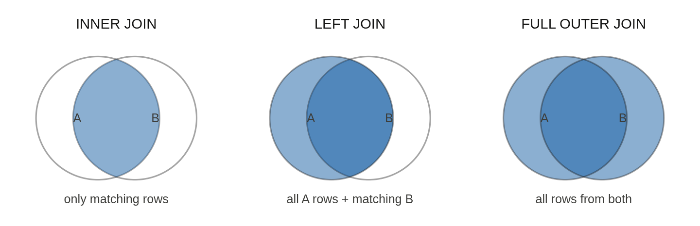
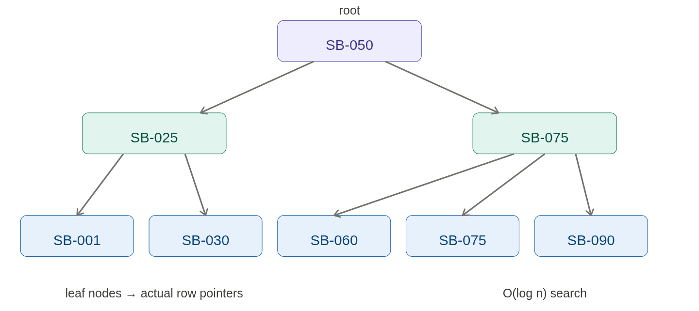
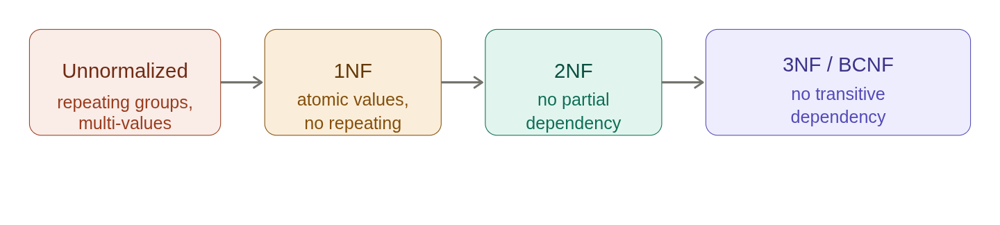

## ACID Properties — Banking Context

---

### 🔑 এক কথায়:

> ACID = Database transaction-এর **4টা guarantee** — এগুলো নিশ্চিত করে যে banking-এর মতো critical system-এ data সবসময় **correct, consistent, আর safe** থাকে।

---

### A — Atomicity (সব অথবা কিছুই না)

> Transaction-এর সব operation **একটা unit** — যেকোনো একটা fail করলে **সব rollback** হয়।

```sql
-- Sourov থেকে Karim-এ 5000 BDT transfer

BEGIN;

UPDATE accounts
SET balance = balance - 5000
WHERE account_id = 'SB-001';   -- Step 1: Debit

-- এখানে server crash হলো! 😱

UPDATE accounts
SET balance = balance + 5000
WHERE account_id = 'SB-002';   -- Step 2: Credit (হলো না!)

COMMIT;
```

```
Without Atomicity:
Sourov-এর 5000 কাটা গেছে ✅
Karim-এর account-এ যোগ হয়নি ❌
5000 BDT হাওয়া! 💀

With Atomicity:
Step 2 fail → Step 1-ও rollback ✅
Sourov-এর balance আগের মতো ✅
কোনো টাকা হারায়নি ✅
```

**Django-তে:**
```python
from django.db import transaction

def transfer_money(from_id, to_id, amount):
    with transaction.atomic():   # ← Atomicity guarantee
        from_acc = Account.objects.select_for_update().get(
            account_id=from_id
        )
        to_acc = Account.objects.select_for_update().get(
            account_id=to_id
        )

        from_acc.balance -= amount
        to_acc.balance += amount

        from_acc.save()
        to_acc.save()   # এখানে fail হলে from_acc.save()-ও rollback ✅

        Transaction.objects.create(
            account=from_acc,
            txn_type="DR",
            amount=amount
        )
    # Block শেষে সব commit অথবা সব rollback
```

---

### C — Consistency (সবসময় valid state)

> Transaction-এর আগে আর পরে database সবসময় **valid state-এ** থাকবে — কোনো rule ভাঙবে না।

```sql
-- Consistency rules banking-এ:
-- ১. Balance কখনো negative হবে না
-- ২. Transfer-এ total money same থাকবে
-- ৩. Foreign key valid থাকবে

-- Constraint দিয়ে enforce করো
CREATE TABLE accounts (
    balance DECIMAL(15,2)
    CHECK (balance >= 0),        -- Rule 1 ✅

    account_id VARCHAR(20)
    REFERENCES accounts(id)      -- Rule 3 ✅
);

-- Transfer consistency check:
-- Before: Sourov=50000, Karim=30000, Total=80000
-- After:  Sourov=45000, Karim=35000, Total=80000 ✅
-- Money তৈরি হয়নি, ধ্বংসও হয়নি
```

```python
# Django Model-level consistency
class Account(models.Model):
    balance = models.DecimalField(max_digits=15, decimal_places=2)

    class Meta:
        constraints = [
            models.CheckConstraint(
                check=models.Q(balance__gte=0),
                name="balance_non_negative"   # DB-level enforce ✅
            )
        ]

    def clean(self):
        if self.balance < 0:
            raise ValidationError("Balance cannot be negative")
```

---

### I — Isolation (আলাদা থাকো)

> একটা transaction চলার সময় অন্য transaction সেটার **intermediate state দেখতে পারবে না।**

```sql
-- সমস্যা: দুটো transaction একসাথে চলছে

-- Transaction A (Sourov withdraw করছে)
BEGIN;
SELECT balance FROM accounts WHERE id=1;  -- 50000 দেখলো
-- এখনো commit হয়নি

-- Transaction B (একই সময়ে Sourov-এর balance চেক)
SELECT balance FROM accounts WHERE id=1;
-- কী দেখবে? 50000 (old) নাকি 45000 (new)?

-- Isolation Level অনুযায়ী ভিন্ন আচরণ
```

**Banking-এ Isolation Problems:**

```
১. Dirty Read:
   T1 balance 45000-এ নামালো (commit হয়নি)
   T2 সেই 45000 পড়লো
   T1 rollback করলো → T2 ভুল data পড়েছে! 😱

২. Non-repeatable Read:
   T1 balance দুবার পড়লো — দুবার আলাদা value
   মাঝখানে T2 update করেছে

৩. Phantom Read:
   T1 transactions count করলো — 10টা
   T2 নতুন transaction insert করলো
   T1 আবার count করলো — 11টা 😱
```

```sql
-- Banking-এ Serializable use করো critical operation-এ
SET TRANSACTION ISOLATION LEVEL SERIALIZABLE;

BEGIN;
SELECT balance FROM accounts WHERE id=1 FOR UPDATE;  -- Lock নিলো
UPDATE accounts SET balance = balance - 5000 WHERE id=1;
COMMIT;
-- অন্য transaction এই row access করতে পারবে না ✅
```

```python
# Django-তে select_for_update() → Row lock
def withdraw(account_id, amount):
    with transaction.atomic():
        account = Account.objects\
            .select_for_update()\   # Row lock ✅
            .get(account_id=account_id)

        # অন্য কোনো transaction এই row touch করতে পারবে না
        if account.balance < amount:
            raise InsufficientBalanceError(account_id, amount, account.balance)

        account.balance -= amount
        account.save()
```

---

### D — Durability (চিরস্থায়ী)

> একবার **COMMIT** হলে data **চিরস্থায়ী** — power চলে গেলেও, server crash হলেও data থাকবে।

```sql
BEGIN;
UPDATE accounts SET balance = 45000 WHERE account_id = 'SB-001';
COMMIT;   -- এই line-এর পরে power গেলেও data safe ✅

-- কীভাবে PostgreSQL Durability নিশ্চিত করে:
-- WAL (Write-Ahead Log) — data change হওয়ার আগে log লেখে
-- fsync — disk-এ physically লেখে memory flush করে
-- Checkpoint — regular interval-এ data file sync করে
```

```
WAL Process:
Transaction COMMIT
      ↓
WAL Log disk-এ লেখা হয়  ← এটা হলেই COMMIT confirm
      ↓
User-কে success বলা হয়
      ↓
(Background-এ data file update হয়)

Power চলে গেলে:
WAL থেকে recover করে
Data file update হয়
কোনো data হারায় না ✅
```

---

### 🏦 Banking-এ ACID — Real Scenario:

```python
def process_payment(sender_id, receiver_id, amount):
    """
    ACID সব চারটা property এই একটা function-এ
    """
    try:
        with transaction.atomic():   # ← ATOMICITY শুরু

            # Row lock — ISOLATION
            sender = Account.objects\
                .select_for_update()\
                .get(account_id=sender_id)

            receiver = Account.objects\
                .select_for_update()\
                .get(account_id=receiver_id)

            # CONSISTENCY check
            if sender.balance < amount:
                raise InsufficientBalanceError(
                    sender_id, amount, sender.balance
                )
            if not sender.is_active or not receiver.is_active:
                raise AccountInactiveError()

            # Actual operation
            sender.balance -= amount
            receiver.balance += amount

            sender.save()    # ATOMICITY — দুটোই হবে
            receiver.save()  # বা কোনোটাই না

            # Transaction log — DURABILITY-র অংশ
            Transaction.objects.create(
                from_account=sender,
                to_account=receiver,
                amount=amount,
                status="completed"
            )

        # COMMIT — এখন DURABILITY নিশ্চিত
        # WAL-এ লেখা হয়েছে, disk-এ safe ✅
        return {"status": "success", "amount": amount}

    except Exception as e:
        # ROLLBACK — ATOMICITY নিশ্চিত
        # sender balance কাটা গেলেও ফিরে আসবে
        logger.error(f"Payment failed: {e}")
        raise
```

---

### 📊 ACID — এক নজরে:

| Property | গ্যারান্টি | Banking Example | ছাড়া কী হতো |
|---|---|---|---|
| **Atomicity** | সব অথবা কিছুই না | Transfer-এ debit হয় credit না হলে rollback | টাকা হারিয়ে যেত |
| **Consistency** | সবসময় valid state | Balance কখনো negative হবে না | Invalid state তৈরি হতো |
| **Isolation** | Transaction আলাদা থাকে | একসাথে দুজন withdraw করতে পারবে না | Double spend হতো |
| **Durability** | Commit মানে চিরস্থায়ী | Crash হলেও committed transaction থাকবে | Data হারিয়ে যেত |

---

### 🎯 Interview Closing line:

> *"ACID ছাড়া banking system চলতে পারে না। Atomicity নিশ্চিত করে টাকা কখনো শূন্যে মিলিয়ে যাবে না। Consistency নিশ্চিত করে balance negative হবে না। Isolation নিশ্চিত করে একই টাকা দুজন একসাথে তুলতে পারবে না — race condition থেকে রক্ষা করে। Durability নিশ্চিত করে COMMIT হলে power চলে গেলেও data safe। Django-তে `transaction.atomic()` আর `select_for_update()` দিয়ে এই চারটাই enforce করি।"*


## JOIN Types & Database Indexes

---

## ১. INNER JOIN vs LEFT JOIN vs FULL OUTER JOIN

---

### 🔑 Visual দিয়ে বোঝো:---

### 💻 Banking Schema দিয়ে সব JOIN দেখো:

```sql
-- Tables
accounts:     account_id | name    | branch_id
branches:     branch_id  | name    | city
transactions: txn_id     | account_id | amount

-- Data
accounts:  SB-001/Sourov/B1, SB-002/Karim/B2, SB-003/Rina/NULL
branches:  B1/Gulshan/Dhaka, B2/Banani/Dhaka, B3/Dhanmondi/Dhaka
```

---

**INNER JOIN — দুটোতেই match থাকলেই শুধু:**
```sql
SELECT a.name, b.name as branch
FROM accounts a
INNER JOIN branches b ON a.branch_id = b.branch_id;

-- Result: (2 rows — Rina বাদ, B3 বাদ)
-- Sourov | Gulshan
-- Karim  | Banani
-- Rina নেই (branch_id = NULL)
-- B3 নেই (কোনো account নেই)
```

**LEFT JOIN — বাম table সব + match হলে ডান:**
```sql
SELECT a.name, b.name as branch
FROM accounts a
LEFT JOIN branches b ON a.branch_id = b.branch_id;

-- Result: (3 rows — সব account)
-- Sourov | Gulshan
-- Karim  | Banani
-- Rina   | NULL    ← branch নেই কিন্তু Rina আছে ✅
```

**FULL OUTER JOIN — দুটো table-এর সব:**
```sql
SELECT a.name, b.name as branch
FROM accounts a
FULL OUTER JOIN branches b ON a.branch_id = b.branch_id;

-- Result: (4 rows)
-- Sourov | Gulshan
-- Karim  | Banani
-- Rina   | NULL      ← account আছে, branch নেই
-- NULL   | Dhanmondi ← branch আছে, account নেই (B3)
```

---

### 🏦 Banking-এ কোনটা কোথায়:

```sql
-- ১. INNER JOIN — শুধু valid data দরকার
-- Active account-এর statement
SELECT t.amount, t.created_at, a.name
FROM transactions t
INNER JOIN accounts a ON t.account_id = a.id
WHERE a.is_active = TRUE;
-- Invalid account-এর transaction দেখাবে না ✅

-- ২. LEFT JOIN — সব account দেখাতে হবে
-- Transaction আছে বা না থাকলেও সব account দেখাও
SELECT a.name,
       COUNT(t.id) as txn_count,
       COALESCE(SUM(t.amount), 0) as total
FROM accounts a
LEFT JOIN transactions t ON a.id = t.account_id
GROUP BY a.id, a.name;
-- Transaction নেই → count=0, total=0 ✅

-- ৩. FULL OUTER JOIN — reconciliation-এ
-- System A আর System B-এর data match করো
SELECT
    a.txn_id as system_a,
    b.txn_id as system_b,
    CASE
        WHEN b.txn_id IS NULL THEN 'Missing in B'
        WHEN a.txn_id IS NULL THEN 'Missing in A'
        ELSE 'Matched'
    END as status
FROM system_a_transactions a
FULL OUTER JOIN system_b_transactions b
ON a.txn_id = b.txn_id
WHERE a.txn_id IS NULL OR b.txn_id IS NULL;
-- Mismatch খুঁজে বের করো ✅
```

---

## ২. Database Indexes

---

### 🔑 Index কী — Visual:

এরপর index-এর B-tree structure দেখো:---

### 💻 Index ছাড়া vs সহ:

```sql
-- Without index: Full Table Scan — O(n)
SELECT * FROM transactions WHERE account_id = 'SB-001';
-- ১০ লাখ row → সব scan করে 😱 (~500ms)

-- With index: B-tree Search — O(log n)
CREATE INDEX idx_txn_account ON transactions(account_id);
-- ১০ লাখ row → মাত্র ~20 step (~1ms) ✅
```

---

### 💻 Index Types — Banking-এ:

```sql
-- ১. Single Column Index
CREATE INDEX idx_account_id ON accounts(account_id);
-- WHERE account_id = 'SB-001' ✅

-- ২. Composite Index — column order matter করে!
CREATE INDEX idx_txn_acc_date
ON transactions(account_id, created_at DESC);
-- WHERE account_id = 'SB-001' ✅
-- WHERE account_id = 'SB-001' AND created_at > '2024-01-01' ✅
-- WHERE created_at > '2024-01-01' ❌ (leading column নেই)

-- ৩. Partial Index — condition-based, smaller, faster
CREATE INDEX idx_active_accounts
ON accounts(account_id)
WHERE is_active = TRUE;
-- শুধু active accounts index-এ → 80% smaller ✅

-- ৪. Covering Index — table access-ই লাগে না
CREATE INDEX idx_covering
ON transactions(account_id)
INCLUDE (amount, created_at, txn_type);
-- এই query-র জন্য table touch করবে না:
SELECT amount, created_at, txn_type
FROM transactions WHERE account_id = 'SB-001';
-- Index-ই সব data দিচ্ছে ✅

-- ৫. Expression Index
CREATE INDEX idx_lower_name ON accounts(LOWER(name));
-- WHERE LOWER(name) = 'sourov' → Index use করবে ✅

-- ৬. GIN Index — JSONB, Array, Full-text
CREATE INDEX idx_metadata ON accounts USING GIN(metadata);
-- WHERE metadata @> '{"kyc": "verified"}' ✅
```

---

### ✅ Index কখন ADD করবে:

```sql
-- ১. Primary/Foreign Key — সবসময়
account_id BIGINT REFERENCES accounts(id)
-- FK-তে automatically index থাকলে JOIN fast হয়

-- ২. Frequently filtered column
WHERE is_active = TRUE     → index দাও
WHERE account_type = 'SB'  → index দাও
WHERE created_at > '...'   → index দাও

-- ৩. JOIN column
ON a.branch_id = b.id      → branch_id-এ index দাও

-- ৪. ORDER BY column
ORDER BY created_at DESC   → created_at-এ index দাও

-- ৫. High cardinality column — unique values বেশি
account_id (millions unique) → ✅ index উপকারী
txn_type (DR/CR শুধু)       → ❌ index কম উপকারী

-- ৬. EXPLAIN ANALYZE দেখে confirm করো
EXPLAIN ANALYZE
SELECT * FROM transactions WHERE account_id = 'SB-001';
-- Seq Scan দেখলে → index দাও
-- Index Scan দেখলে → already আছে ✅
```

---

### ❌ Index কখন AVOID করবে:

```sql
-- ১. Low cardinality — unique values কম
CREATE INDEX idx_gender ON accounts(gender);
-- ❌ শুধু M/F/O → full scan-এর চেয়ে slow হতে পারে!
-- Optimizer often ignores it anyway

-- ২. Write-heavy table
-- Index = প্রতিটা INSERT/UPDATE/DELETE-এ update হয়
-- High-frequency transaction log table-এ index কম রাখো
-- INSERT INTO audit_logs → বারবার index update হবে 😱

-- ৩. Small table
CREATE INDEX idx_branches ON branches(branch_id);
-- ❌ শুধু ১০টা branch → full scan-ই দ্রুত
-- Index overhead বেশি, benefit নেই

-- ৪. Rarely queried column
CREATE INDEX idx_notes ON accounts(internal_notes);
-- ❌ কেউ notes দিয়ে query করে না → waste

-- ৫. Function on indexed column
WHERE YEAR(created_at) = 2024
-- ❌ Index use হবে না!
-- ✅ Fix: WHERE created_at BETWEEN '2024-01-01' AND '2024-12-31'

-- ৬. Leading wildcard
WHERE name LIKE '%Sourov%'
-- ❌ Index use হবে না
-- ✅ Fix: Full-text search বা edge n-gram
```

---

### 💻 Index কাজ করছে কিনা দেখো:

```sql
-- EXPLAIN ANALYZE দিয়ে verify করো
EXPLAIN ANALYZE
SELECT t.amount, a.name
FROM transactions t
JOIN accounts a ON t.account_id = a.id
WHERE t.created_at > NOW() - INTERVAL '30 days'
AND a.is_active = TRUE;

-- Good output:
-- Index Scan using idx_txn_date on transactions
-- cost=0.56..150.23 rows=1000

-- Bad output:
-- Seq Scan on transactions
-- cost=0.00..85000.00 rows=1000000 ← Full scan! 😱

-- Unused indexes খুঁজে বের করো
SELECT indexrelname, idx_scan, idx_tup_read
FROM pg_stat_user_indexes
WHERE schemaname = 'public'
ORDER BY idx_scan ASC;
-- idx_scan = 0 → কখনো use হয়নি → DROP করো!

-- Index size দেখো
SELECT indexname, pg_size_pretty(pg_relation_size(indexname::text))
FROM pg_indexes WHERE tablename = 'transactions';
```

---

### 📊 JOIN Types Summary:

| JOIN | কী দেয় | Banking use |
|---|---|---|
| `INNER JOIN` | Match করা rows শুধু | Valid transaction report |
| `LEFT JOIN` | বাম সব + match | সব account-এর summary |
| `RIGHT JOIN` | ডান সব + match | সব branch-এর summary |
| `FULL OUTER JOIN` | দুটোর সব | Reconciliation |
| `SELF JOIN` | Same table | Employee hierarchy |

---

### 📊 Index Summary:

| | Add করো | Avoid করো |
|---|---|---|
| **Cardinality** | High (account_id) | Low (gender, status) |
| **Query** | Frequent WHERE/JOIN | Rarely queried |
| **Table size** | Large | Small (< 1000 rows) |
| **Operations** | Read-heavy | Write-heavy |
| **Pattern** | Exact/range match | Leading wildcard |

---

### 🎯 Interview Closing line:

> *"JOIN choice করি data requirement অনুযায়ী — transaction report-এ INNER JOIN কারণ শুধু valid data দরকার, account summary-তে LEFT JOIN কারণ transaction না থাকলেও account দেখাতে হবে, reconciliation-এ FULL OUTER JOIN কারণ দুটো system-এর mismatch খুঁজতে হবে। Index-এ সবার আগে EXPLAIN ANALYZE দেখি — Seq Scan দেখলে index দিই, কিন্তু write-heavy table-এ সতর্ক থাকি কারণ প্রতিটা write-এ index maintain করতে হয়। Composite index-এ column order সবচেয়ে গুরুত্বপূর্ণ — most selective column আগে।"*

## Clustered vs Non-clustered Index & Normalization Forms

---

## ১. Clustered vs Non-clustered Index

---### 💻 Clustered Index:

```sql
-- Primary Key → automatically Clustered Index (PostgreSQL-এ CLUSTER command দরকার)
CREATE TABLE accounts (
    account_id VARCHAR(20) PRIMARY KEY,  -- Clustered (default)
    name VARCHAR(100),
    balance DECIMAL(15,2)
);

-- Data physically account_id order-এ store হয়:
-- SB-001, SB-002, SB-003... (disk-এ এই order-এই)

-- Range query → খুব দ্রুত (physically consecutive)
SELECT * FROM accounts
WHERE account_id BETWEEN 'SB-001' AND 'SB-100';
-- Disk-এ পাশাপাশি থাকে → একটা read-এ অনেক data ✅

-- PostgreSQL-এ manually cluster করো
CLUSTER accounts USING accounts_pkey;
-- Data physically reorder হলো

-- Problem: Insert করলে reorder দরকার হতে পারে
-- SB-050 insert করলে মাঝখানে জায়গা করতে হবে
```

### 💻 Non-clustered Index:

```sql
-- আলাদা B-tree structure — data move হয় না
CREATE INDEX idx_balance ON accounts(balance);
-- Index: sorted by balance → pointer to actual row

-- Multiple non-clustered index allowed
CREATE INDEX idx_name    ON accounts(name);
CREATE INDEX idx_branch  ON accounts(branch_id);
CREATE INDEX idx_balance ON accounts(balance);
-- সবগুলো আলাদা structure, heap-এ point করে

-- Extra lookup দরকার হয়:
-- Index → row pointer → heap → actual data (2 steps)
-- Clustered: Index = data (1 step) ✅

-- Covering index দিয়ে heap lookup এড়ানো যায়
CREATE INDEX idx_covering
ON accounts(branch_id)
INCLUDE (name, balance);  -- এই query-তে heap যেতেই হবে না
SELECT name, balance FROM accounts WHERE branch_id = 1;
```

### 📊 পার্থক্য:

| | Clustered | Non-clustered |
|---|---|---|
| Data storage | Index-এই data | আলাদা heap-এ |
| Per table | ১টা মাত্র | অনেকগুলো |
| Range query | ✅ খুব দ্রুত | মাঝারি |
| Lookup steps | ১টা | ২টা (index + heap) |
| Insert cost | বেশি (reorder) | কম |
| Banking use | `account_id` PK | `balance`, `name`, `branch_id` |

---

## ২. Normalization — 1NF থেকে BCNFBanking-এ একটা খারাপ table ধরে ধাপে ধাপে normalize করা যাক।



---

### শুরু — Unnormalized Table:

```
account_transactions (খুব খারাপ design):

account_id | account_name | branch_id | branch_city | phones          | txn1_amt | txn2_amt
SB-001     | Sourov       | B1        | Dhaka       | 01711, 01811    | 500      | 1000
SB-002     | Karim        | B1        | Dhaka       | 01911           | 250      | NULL
SB-003     | Rina         | B2        | Chittagong  | 01611, 01711    | 750      | 500

সমস্যা:
- phones column-এ multiple values (01711, 01811)
- txn1_amt, txn2_amt repeating groups
- branch_city depends on branch_id, not account_id
```

---

### 1NF — Atomic Values, No Repeating Groups:

**Rule: প্রতিটা cell-এ একটাই value, কোনো repeating group নেই।**

```sql
-- ❌ 1NF violate
account_id | phones
SB-001     | "01711, 01811"    -- multiple values!
SB-001     | txn1=500, txn2=1000  -- repeating columns!

-- ✅ 1NF fix — atomic করো
-- Phone আলাদা table-এ
CREATE TABLE account_phones (
    account_id VARCHAR(20),
    phone      VARCHAR(15),
    PRIMARY KEY (account_id, phone)
);
-- SB-001 | 01711
-- SB-001 | 01811  ← আলাদা row ✅

-- Transaction আলাদা table-এ
CREATE TABLE transactions (
    txn_id     BIGSERIAL PRIMARY KEY,
    account_id VARCHAR(20),
    amount     DECIMAL(15,2)
);
-- txn1, txn2 column এর বদলে আলাদা rows ✅

-- 1NF result:
accounts (account_id, account_name, branch_id, branch_city)
account_phones (account_id, phone)
transactions (txn_id, account_id, amount)
```

---

### 2NF — No Partial Dependency:

**Rule: Composite key থাকলে non-key column সম্পূর্ণ key-এর উপর depend করতে হবে — শুধু একটা অংশের উপর না।**

```sql
-- ❌ 2NF violate (composite key: account_id + product_id)
account_products:
account_id | product_id | account_name | product_name | signup_date
SB-001     | LOAN       | Sourov       | Home Loan    | 2024-01-01
SB-001     | FD         | Sourov       | Fixed Dep.   | 2024-02-01
SB-002     | LOAN       | Karim        | Home Loan    | 2024-01-15

-- সমস্যা:
-- account_name depends only on account_id (partial dependency!) 😱
-- product_name depends only on product_id (partial dependency!) 😱
-- signup_date depends on BOTH → OK ✅

-- ✅ 2NF fix — আলাদা table-এ নাও
CREATE TABLE accounts (
    account_id   VARCHAR(20) PRIMARY KEY,
    account_name VARCHAR(100)   -- শুধু account_id-এর উপর depend ✅
);

CREATE TABLE products (
    product_id   VARCHAR(10) PRIMARY KEY,
    product_name VARCHAR(100)   -- শুধু product_id-এর উপর depend ✅
);

CREATE TABLE account_products (
    account_id  VARCHAR(20) REFERENCES accounts(account_id),
    product_id  VARCHAR(10) REFERENCES products(product_id),
    signup_date DATE,           -- composite key-এর উপর depend ✅
    PRIMARY KEY (account_id, product_id)
);
```

---

### 3NF — No Transitive Dependency:

**Rule: Non-key column অন্য non-key column-এর উপর depend করতে পারবে না।**

```sql
-- ❌ 3NF violate
accounts:
account_id | account_name | branch_id | branch_name | branch_city
SB-001     | Sourov       | B1        | Gulshan     | Dhaka
SB-002     | Karim        | B1        | Gulshan     | Dhaka  ← duplicate!
SB-003     | Rina         | B2        | Banani      | Dhaka  ← duplicate!

-- সমস্যা (Transitive Dependency):
-- account_id → branch_id ✅
-- branch_id  → branch_name, branch_city 😱
-- তাই: account_id → branch_name (transitively) ← 3NF violate!

-- Update anomaly:
-- Gulshan branch-এর city change হলে
-- SB-001 আর SB-002 দুটো row update করতে হবে 😱

-- ✅ 3NF fix — branch আলাদা table-এ
CREATE TABLE branches (
    branch_id   VARCHAR(10) PRIMARY KEY,
    branch_name VARCHAR(100),   -- branch_id-এর উপর directly depend ✅
    branch_city VARCHAR(50)     -- branch_id-এর উপর directly depend ✅
);

CREATE TABLE accounts (
    account_id   VARCHAR(20) PRIMARY KEY,
    account_name VARCHAR(100),
    branch_id    VARCHAR(10) REFERENCES branches(branch_id)
    -- branch_name, branch_city সরিয়ে দিলাম ✅
);

-- এখন branch city update হলে শুধু branches table-এ একবার change ✅
```

---

### BCNF — Boyce-Codd Normal Form (3NF-এর stronger version):

**Rule: প্রতিটা functional dependency-তে বাম পাশ অবশ্যই superkey হতে হবে।**

```sql
-- ❌ BCNF violate (3NF-এ আছে কিন্তু BCNF-এ নেই)
-- Scenario: একজন teller শুধু একটা branch-এ কাজ করে
--           একটা account শুধু একটা branch-এ থাকে

account_teller:
account_id | teller_id | branch_id
SB-001     | T01       | B1
SB-001     | T02       | B1        ← SB-001 একই branch-এ দুজন teller
SB-002     | T01       | B1

-- Functional Dependencies:
-- (account_id, teller_id) → branch_id  ← composite key → branch
-- teller_id → branch_id               ← teller থেকে branch! 😱
--                                         teller_id superkey না

-- ✅ BCNF fix
CREATE TABLE teller_branch (
    teller_id  VARCHAR(10) PRIMARY KEY,
    branch_id  VARCHAR(10) REFERENCES branches(branch_id)
    -- teller_id → branch_id (teller_id is superkey here) ✅
);

CREATE TABLE account_teller (
    account_id VARCHAR(20),
    teller_id  VARCHAR(10) REFERENCES teller_branch(teller_id),
    PRIMARY KEY (account_id, teller_id)
    -- branch_id সরিয়ে দিলাম ✅
);
```

---

### 💻 Final Normalized Banking Schema:

```sql
-- সব normalization apply করার পরে:

CREATE TABLE branches (
    branch_id   VARCHAR(10) PRIMARY KEY,
    branch_name VARCHAR(100) NOT NULL,
    city        VARCHAR(50)  NOT NULL
);

CREATE TABLE accounts (
    account_id   VARCHAR(20) PRIMARY KEY,
    account_name VARCHAR(100) NOT NULL,
    branch_id    VARCHAR(10) REFERENCES branches(branch_id),
    balance      DECIMAL(15,2) DEFAULT 0
);

CREATE TABLE account_phones (
    account_id VARCHAR(20) REFERENCES accounts(account_id),
    phone      VARCHAR(15) NOT NULL,
    PRIMARY KEY (account_id, phone)
);

CREATE TABLE products (
    product_id   VARCHAR(10) PRIMARY KEY,
    product_name VARCHAR(100)
);

CREATE TABLE account_products (
    account_id  VARCHAR(20) REFERENCES accounts(account_id),
    product_id  VARCHAR(10) REFERENCES products(product_id),
    signup_date DATE,
    PRIMARY KEY (account_id, product_id)
);

CREATE TABLE transactions (
    txn_id     BIGSERIAL PRIMARY KEY,
    account_id VARCHAR(20) REFERENCES accounts(account_id),
    amount     DECIMAL(15,2) NOT NULL,
    txn_type   CHAR(2),
    created_at TIMESTAMPTZ DEFAULT NOW()
);
```

---

### 📊 Normalization Summary:

| Form | Rule | Fix করে | Banking Example |
|---|---|---|---|
| **1NF** | Atomic values, no repeating | Multi-value cells | phones → আলাদা table |
| **2NF** | No partial dependency | Composite key-এ partial | product_name → products table |
| **3NF** | No transitive dependency | Non-key → non-key | branch_city → branches table |
| **BCNF** | Every determinant = superkey | 3NF-এ missed cases | teller → branch আলাদা |

---

### 🎯 Interview Closing line:

> *"Clustered index মানে data physically sorted হয়ে store হয় — banking-এ account_id-এর Primary Key automatically clustered, তাই range query অনেক দ্রুত। Non-clustered index আলাদা structure — pointer দিয়ে heap-এ যায়, একটা table-এ অনেকগুলো থাকতে পারে balance বা name search-এর জন্য। Normalization-এ 1NF atomic করে, 2NF partial dependency সরায়, 3NF transitive dependency সরায়, BCNF আরো strict। Banking schema-তে branch city, product name — এগুলো আলাদা table-এ না রাখলে একটা city update-এ হাজারটা row change করতে হতো।"*